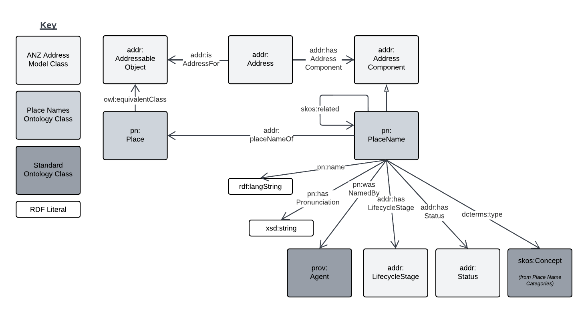
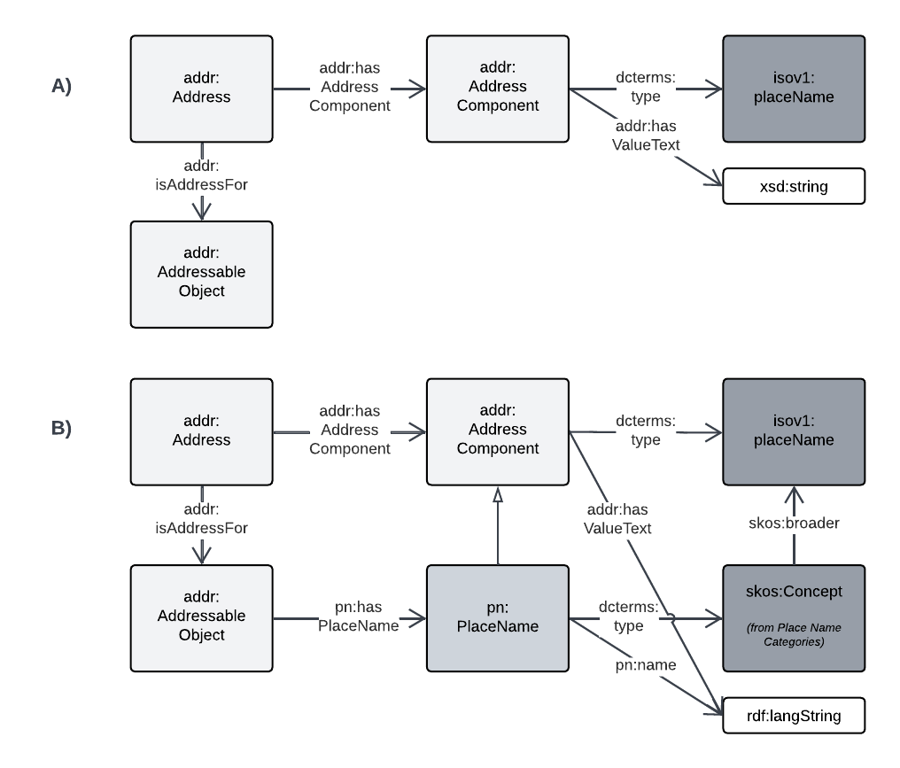

= QSI Place Names Model
:toc: left
:toclevels: 3
:table-stripes: even
:sectnums:
:sectids:
:sectanchors:

This model is a profile of the Australian Government's https://linked.data.gov.au/def/placenames[Place Names Ontology] and the https://w3id.org/profile/anz-address[ANZ National Address Model].

It does not define any new classes or properties but just indicates a particular pattern of use of the Place Names Ontology with the ANZ National Address Model and several other, standard, ontologies.

== Definition

The formal definition of this profile is given below in human-readable form and in machine-readable form in the file https://nicholascar.com/qsi-supermodel/qsi-placenames/model.ttl[model.ttl].

[cols="1,4"]
|===
| Property | Value

| IRI | `https://w3id.org/profile/qsi-placenames`
| Preferred Label | QSI Place Names Model
| Definition | A profile of the ANZ National Address Model and the Place Names Ontology for the representation of Place Names in Queensland
| Is profile of | https://linked.data.gov.au/def/placenames[`placenames`] , https://w3id.org/profile/anz-address[`anz-address`]
| Creator | https://orcid.org/0000-0002-8742-7730[Nicholas J. Car]
| Publisher | -
| Created | 2022-06-24
| Modified | 2022-06-24
| Issued | 0000-00-00
| License | https://creativecommons.org/licenses/by/4.0/[Creative Commond BY 4.0]
| Rights | (c) Nicholas Car, 2022
| Version IRI | https://w3id.org/profile/qsi-placename/1.0
| Version info | 1.0
| Code repository | https://github.com/nicholascar/qsi-supermodel
|===

== Model

The figure below overviews this model. 

[id=fig-overview]
.Overview OWL Diagram of the QSI Place Names Model


The central classes of this model are `PlaceName` and `Place` from the https://linked.data.gov.au/def/placenames[Place Names Ontology] which are related to `AddressComponent` and `AddressableObject` within the https://w3id.org/profile/anz-address[ANZ National Address Model] respectively. A `PlaceName` is equivalent to an `AddressComponent` sub typed as `placeName` from the https://nicholascar.com/anz-nat-addr-model-candidate/model.html#_address_component_types_vocabulary[Address Component Types vocabulary] and a `Place` is equivalent to an `AddressableObject`.

Modelled in this way, a `Place` may be both related to `Address` objects and `PlaceName` objects and the `PlaceName` object may be modelled as `Address` objects if that's useful.

NOTE: The ANZ National Address Model relates `Address` objects to `LifecycleStage` objects to know what point in an acceptance process the `Address` is in now or was in at some point in the past. This modelling reuses the same relation for a `PlaceName` and does not use the `status` property modelled in the Place Names Ontology.

To further detail this modelling, 

[id=fig-defail]
.Detailed modelling of the `Address`, `AddressableObject` and `AddressComponent` classes in the https://w3id.org/profile/anz-address[ANZ National Address Model] (A) and how this Place Names modelling relates to it (B). Note that the target of an `AddressComponent` object's `hasValue' property is what a `PlaceName` object references with the property `name`.


=== Examples

For these examples, the following namespaces are used:

[cols="1,5,4"]
|===
| Prefix | Namespace | Note

| `addr` | `+https://w3id.org/profile/anz-address/+` | ANZ Address Model namespace
| `addrct` | `+http://w3id.org/profile/anz-address/address-component-type/+` | ANZ Address Model's Address Component Types vocabulary's namespace
| `dcterms:` | `+http://purl.org/dc/terms/+` | Dublin Core Terms vocabulary namespace
| `ex` | `+http://example.com/+` | An example namespace
| `isov1:` | `+http://def.isotc211.org/iso19160/-1/2015/Address/code/AddressComponentType/+` | The `AddressComponentType` vocabulary namespace from the ANZ Address Model
| `isov2:` | `+https://w3id.org/profile/anz-address/AddressLifecycleStageType/+` | The `AddressLifecycleStage` vocabulary namespace from the ANZ Address Model
| `geo` | `+http://www.opengis.net/ont/geosparql#+` | The GeoSAPRQL Ontology's namespace
| `owl:` | `+http://www.w3.org/2002/07/owl#+` | Web Ontology Language ontology namespace
| `pn` | `+http://linked.data.gov.au/def/placenames/+` | The Place Names Ontology namespace
| `pnc` | `+https://linked.data.gov.au/def/placenames-categories/+` | The Place Names Categories vocabulary's namespace
| `rdfs` | `+http://www.w3.org/2000/01/rdf-schema#+` | The namespace of the fundamental RDF Schema model used for OWL mododelling
| `time` | `+http://www.w3.org/2006/time#+` | Time Ontology in OWL namespace
| `xsd:` | `+http://www.w3.org/2001/XMLSchema#+` | XML Schema Definitions ontology namespace
|===

==== Haunted House Place Name

Imagine a property of State significance with a Place Name. 

The `PlaceName` "Haunted House" could be assigned to the `Place` - a `Property` in the Cadastral Model - like this:

```turtle
ex:haunted-house
    a pn:PlaceName ;
    pn:name "Haunted House"@en ;
    pn:placeNameOf ex:property-x ;
    dcterms:provenance "The name Haunted House was assigned to this Place informally in the 1990 as children growing up near the house believed an apparition of a headless man resided there. The State officially recognised this name on Halloween in 1999."@en ;
    addr:hasLifecycleStage [
        time:hasTime [
            time:hasBeginning [ time:inXSDgYear "1993"^^xsd:gYear ] ;
            time:hasEnd [ time:inXSDDate "1999-10-31"^^xsd:date ] ;
        ] ;
        dcterms:type isov2:proposed ;
    ] ,    
    [
        time:hasTime [
            time:hasBeginning [ time:inXSDDate "1999-10-31"^^xsd:date ] ;
        ] ;
        dcterms:type isov2:current ;
        pn:wasNamedBy ex:qld-state-government ;
        dcterms:source "http://example.com/press-releases/minister-names-haunted-house"^^xsd:anyURI ;
    ]
.

ex:property-x
    a pn:Place ;
    geo:hasGeometry [
        geo:asWKT "POINT(153.08468369 -27.32703398)"^^geo:wktLiteral 
    ] ;
.
```

Notes:

* Location is not a property of the `PlaceName`, which is just a fancy label, but of the object labeled - the `Place`.
* The current state of the `PlaceName` "current" (synonym for "gazetted") can be determined by looking for the `LifecycleStage` whose temporal footprint we are within (i.e. the one stated before not and not yet ended)
* Notes on the initiation of the `LifecycleStage` "current", i.e. the assigning of the `PlaceName` as official, are included in that `LifecycleStage` - `wasNamedBy` and `source`

==== Haunted House Address

If the Haunted House modelled above had the address:

```
20 Oxford Place
Shorncliffe, QLD 4017
```

Its parts and relation to an `AddressableObject` - the same object as the `Place` above - could be modelled like this:

```turtle
ex:20-oxford-place
    a addr:Address ;
    addr:hasAddressComponent
        [
            dcterms:type addrct:numberFirst ;
            addr:hasValueText "20" ;
            addr:hasValue 20
        ] ,
        [
            dcterms:type addrct:streetLocality ;
            addr:hasValueText "Oxford Place" ;
            addr:hasValue <https://linked.data.gov.au/dataset/gnaf/streetLocality/QLD140492>
        ] ,
        [
            dcterms:type addrct:locality ;
            addr:hasValueText "Shorncliffe" ;
            addr:hasValue <https://linked.data.gov.au/dataset/gnaf/locality/loc38f189794e03>
        ] ,
        [
            dcterms:type addrct:administrativeArea ;
            addr:hasValueText "Queensland" ;
            addr:hasValue <https://linked.data.gov.au/dataset/asgsed3/STE/3>
        ] ,
        [
            dcterms:type isov1:postcode ;
            addr:hasValueText "4017" ;
            addr:hasValue 4017
        ] ;
    addr:hasGeocode [
            dcterms:type <https://linked.data.gov.au/dataset/gnaf/code/geocodeType/PC> ;  # Property Centroid
            geo:asWKT "POINT(153.08468369 -27.32703398)"^^geo:wktLiteral
        ] ;
    addr:isAddressFor ex:property-x ;
.
```

Notes:

* the `Address` here is located with a relation to a `Geocode` which has the same value as the geometry of the `Place` in the above modelling. It's the same value as it's the Property Centroid of the `Place`/`AddressableObject`

==== A PlaceName as an AddressComponent

To model the Place Name of "Haounted House" as a componet of the above modelled property's `Address`, a `placeName` component may be used like this:

```turtle
ex:20-oxford-place
    a addr:Address ;
    addr:hasAddressComponent
        [
            dcterms:type addrct:placeName ;
            addr:hasValueText "Haunted House" ;
            addr:hasValue "Haunted House"@en ;
            dcterms:provenance "The name Haunted House was assigned to this Place informally in the 1990 as children growing up near the house believed an apparition of a headless man resided there. The State officially recognised this name on Halloween in 1999."@en ;
        ] ;
.    
```

Notes:

* the property `placeNameOf` linking the `PlaceName` to the `Place` can be inferred since the `placeName` type `AddressComponent` here is for an `Address` that is for an `AddressableObject`
** the inference axiom is: `pn:placeNameOf owl:PropertyChainAxiom ( ^addr:hasAddressComponent addr:isAddressFor )`

==== Combined Modelling

The mdoelling of the previous three subsections is combined in the file https://github.com/nicholascar/qsi-supermodel/qsi-placenames/oxford-place-haunted.ttl[oxford-place-haunted.ttl] in this model's code repository.

Note that the Place Name allocated to the property in the examples above could appear as a part of a printed address if desired, perhaps:

```
Haunted House
20 Oxford Place
Shorncliffe QLD 0417
```

All that would be required for this rendering is an address text template that orders `placeName` Address Components in relation to other Address Componets (`flatNumber` etc.).

=== Place Name Categorisation

Previous modelling of Place Names in the https://linked.data.gov.au/def/placenames[Place Names Ontology] sought to categorise instances of the `Place` class with the https://linked.data.gov.au/def/placenames-categories[Place Names Categories] vocabulary. This model does not follow that categorisation and instead uses the Place Names Categories vocabulary to categorise _Place Name_ objects, not _Place_ objects. 

The corollory of this is that all Concepts within the Place Names Categories vocabulary are narrower Concepts of the https://nicholascar.com/anz-nat-addr-model-candidate/model.html#_address_component_types_vocabulary[Address Component Types vocabulary]'s "place name" Concept.

To demonstrate the combined hierarchy, a portion of the Address Component Types vocabulary is:

* property name
* thoroughfare name
* place name
* number first
* ...
* flat number
* postcode

The Place Names Categories may be insterted as refined concepts, narrower than `addrct:placeName` like so:

* property name
* thoroughfare name
* place name
** Administration
** Culture
** ...
** Hydrology
** Landcover
** ...
* number first
* ...
* flat number
* postcode

The sense of this is that Addresses can have components of various types, one of which is a "place name". If a component is a "place name", it might be further categorised as a "Hydrology" or "Administration" place name. Likely the example place name here of "Haunted House" could be categorised as:

* place name
** Culture
*** Landmark

== Queries

The following https://www.w3.org/TR/sparql11-query/[SPARQL] queries are provided to indicate how Place Names stored according to this model as Address Components may be extracted as "pure" Place Names. suce queries obviate the need for duplicative storage of Address Components and Place Names: the former only need be stored and the latter is able to be created as needed.

=== Test data

The following data is for the "Haunted House" example above stored as an Address with Address Components and additional Place Names ontology elements but not also as a Place Name directly. 

Also given is:

* the polygonal geometry of the Addressable Object, rather than a Point which would likely be a property centroid
* the Address' Geocode, still given as a property centroid point
* a second Address without a place name component

Not included for simplicity's sake is the Lifecycle Stage elements of the above examples.

```turtle
PREFIX addr: <https://w3id.org/profile/anz-address/>
PREFIX addrct: <http://w3id.org/profile/anz-address/address-component-type>
PREFIX dcterms: <http://purl.org/dc/terms/>
PREFIX ex: <http://example.com/>
PREFIX geo: <http://www.opengis.net/ont/geosparql#>
PREFIX isov1: <http://def.isotc211.org/iso19160/-1/2015/Address/code/AddressComponentType/>
PREFIX pn: <http://linked.data.gov.au/def/placenames/>
PREFIX pnc: <https://linked.data.gov.au/def/placenames-categories/>
PREFIX xsd: <http://www.w3.org/2001/XMLSchema#>


ex:20-oxford-place
    a addr:Address ;
    addr:hasAddressComponent
        [
            dcterms:type addrct:placeName , pnc:LANDMARK ;
            addr:hasValue "Haunted House"@en ;
            addr:hasValueText "Haunted House" ;
            dcterms:provenance "The name Haunted House was assigned to this Place informally in the 1990 as children growing up near the house believed an apparition of a headless man resided there. The State officially recognised this name on Halloween in 1999."@en ;            
        ] ,
        [
            dcterms:type addrct:numberFirst ;
            addr:hasValue 20 ;
            addr:hasValueText "20"
        ] ,
        [
            dcterms:type addrct:streetLocality ;
            addr:hasValue <https://linked.data.gov.au/dataset/gnaf/streetLocality/QLD140492> ;
            addr:hasValueText "Oxford Place"
        ] ,
        [
            dcterms:type addrct:locality ;
            addr:hasValue <https://linked.data.gov.au/dataset/gnaf/locality/loc38f189794e03> ;
            addr:hasValueText "Shorncliffe"
        ] ,
        [
            dcterms:type addrct:administrativeArea ;
            addr:hasValue <https://linked.data.gov.au/dataset/asgsed3/STE/3> ;
            addr:hasValueText "Queensland"
        ] ,
        [
            dcterms:type isov1:postcode ;
            addr:hasValue 4017 ;
            addr:hasValueText "4017"
        ] ;
    addr:hasGeocode [
            dcterms:type <https://linked.data.gov.au/dataset/gnaf/code/geocodeType/PC> ;
            geo:asWKT "POINT(153.08468369 -27.32703398)"^^geo:wktLiteral
        ] ;
    addr:isAddressFor ex:property-x ;
.

ex:property-x
    a addr:AddressableObject ;
    geo:hasGeometry [
            geo:asWKT "POLYGON ((153.0846659 -27.3268844, 153.0845532 -27.3269404, 153.0846914 -27.3271691, 153.0848081 -27.3271143, 153.0846659 -27.3268844))"^^geo:wktLiteral
        ] ;
.

# another Address irrelevant for Place Naming
ex:16-oxford-place
    a addr:Address ;
    addr:hasAddressComponent
        [
            dcterms:type addrct:streetLocality ;
            addr:hasValue <https://linked.data.gov.au/dataset/gnaf/streetLocality/QLD140492> ;
            addr:hasValueText "Oxford Place"
        ] ,
        [
            dcterms:type addrct:numberFirst ;
            addr:hasValue 16 ;
            addr:hasValueText "16"
        ] ;
.
```

This data is also presented in the file https://nicholascar.com/qsi-supermodel/qsi-placenames/query-testing.ttl[query-testing.ttl].

=== Query: Extraction

The folloqing SPARQL query will select only Address objects that have an Address Component of type `placeName` and some of the relevant Place Naming properties:

```sparql
PREFIX addr: <https://w3id.org/profile/anz-address/>
PREFIX addrct: <http://w3id.org/profile/anz-address/address-component-type>
PREFIX dcterms: <http://purl.org/dc/terms/>

SELECT ?a ?v ?p ?c
WHERE {
    ?a a addr:Address ;
        addr:hasAddressComponent ?ac .
  
  	?ac dcterms:type addrct:placeName ;
       addr:hasValue ?v ;
       dcterms:provenance ?p ;
	.
  
  { ?ac dcterms:type ?c }
  
  FILTER ( ?c != addrct:placeName )
}
```

The results from executing this query against the <<Test data>> are:

|===
| ?a | ?v | ?p | ?c

| `+<http://example.com/20-oxford-place>+` | "Haunted House"@en | "The name Haunted House ... on Halloween in 1999."@en | `+<https://linked.data.gov.au/def/placenames-categories/LANDMARK>+`
|===

=== Query: Transform

To transform the Address with Place Name information in the <<Test data>> into a "plain" Place Name, the following `CONSTRUCT` SPARQL query can be used instead of a `SELECT` query:

```sparql
PREFIX addr: <https://w3id.org/profile/anz-address/>
PREFIX addrct: <http://w3id.org/profile/anz-address/address-component-type>
PREFIX dcterms: <http://purl.org/dc/terms/>
PREFIX geo: <http://www.opengis.net/ont/geosparql#>
PREFIX pn: <http://linked.data.gov.au/def/placenames/>

CONSTRUCT {
      ?ac a pn:PlaceName ;
          	pn:placeNameOf ?ao ;
          	pn:name ?v ;
          	dcterms:provenance ?p ;
          	dcterms:type ?c .

    ?ao
      	a pn:Place ;
      	geo:hasGeometry [
			geo:asWKT ?g ;
      	] . 
}
WHERE {
    ?a addr:hasAddressComponent ?ac ;
          addr:isAddressFor ?ao ;
          addr:hasGeocode/geo:asWKT ?g .
  
  	?ac dcterms:type addrct:placeName ;
         addr:hasValue ?v ;
         dcterms:provenance ?p ;
	.
  
	{ ?ac dcterms:type ?c }
  
    FILTER ( ?c != addrct:placeName )
}
```

The above query yields the following result:

```turtle
PREFIX dcterms: <http://purl.org/dc/terms/>
PREFIX ex: <http://example.com/>
PREFIX geo: <http://www.opengis.net/ont/geosparql#>
PREFIX pn: <http://linked.data.gov.au/def/placenames/>
PREFIX pnc: <https://linked.data.gov.au/def/placenames-categories/>

[]  
    a pn:PlaceName ;
    pn:name "Haunted House"@en ;
    pn:placeNameOf ex:property-x ;
    dcterms:provenance "The name Haunted House was assigned to this Place informally in the 1990 as children growing up near the house believed an apparition of a headless man resided there. The State officially recognised this name on Halloween in 1999."@en ;
    dcterms:type pnc:LANDMARK ;
.

ex:property-x
    a pn:Place ;
    geo:hasGeometry [
            geo:asWKT "POINT(153.08468369 -27.32703398)"^^geo:wktLiteral
        ] ;
.
```

Here the Geocode of the address has been used for the Geometry of the Place. 

Replacing the Geocode match in the query above, `?a addr:hasGeocode/geo:asWKT ?g` with this, `?ao geo:hasGeometry/geo:asWKT ?g .`, will use the polygonal Geometry of the Addressable Object, rather than the Address' Geocode, for the Place's Geometry. The Place data will now be:

```turtle
ex:property-x  
    a pn:Place ;
    geo:hasGeometry  [ 
        geo:asWKT  "POLYGON ((153.0846659 -27.3268844, 153.0845532 -27.3269404, 153.0846914 -27.3271691, 153.0848081 -27.3271143, 153.0846659 -27.3268844))"^^geo:wktLiteral ;
    ] ;
.
```

