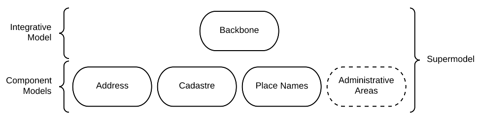
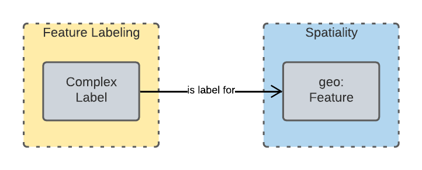
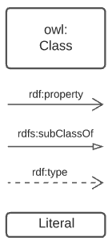
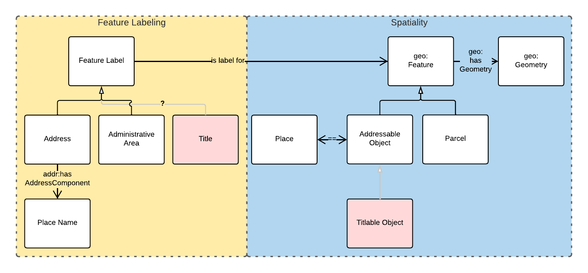

= Queensland Spatial Information Supermodel
:toc: left
:toclevels: 3
:table-stripes: even
:sectnums:
:sectids:
:sectanchors:

This is an overarching model - a Supermodel - used to integrate multiple, individual, models together for use within a particular scenario.

This scenario is that of Queensland Cadastre, Addressing, Place Naming and Admin Areas.

== Introduction

The purpose of a Supermodel such as this one is to allow for data integration across multiple component models. This particular Supermodel indicates how to integrate data formulated according to the <<ANZ National Address Model>> (Candidate), the proposed <<QSI Cadastral Model>>, a model for Place Names and anotehr for Administrative Areas.

The Supermodel does this by implementing a <<Backbone Model>> that is an abstracted version of the main objects within the various Component Models. This Backbone Model does not implement any material not already present in the Component Model.

=== Modelling Methods

All the Component Models and the Backbone Model given here are implemented using the Web Ontology Language known as OWL <<OWL>>. OWL is a well used, standardised, powerful, formal, modelling language. Use of OWL creates data models that can be visualised and also that data can be validated against in automated ways, see <<Annex A: Validators>>.

OWL modelling is a set-theoretic modelling language which means using it involves placing things - concepts, digital representations of real-world objects - into _classes_. Objects in the classes are all similar in some way: perhaps they all have similar _properties_.

In this Supermodel, some fundamental classes are used for all things within scope, such as:

* `Feature` - Anything spatial (being or having a shape, position or an extent)
** From the GeoSPARQL 1.1 Ontology <<GEO>>
* `Geometry` - A coherent set of direct positions in space. The positions are held within a Spatial Reference System (SRS)
** From <<GEO>>
* `FeatureLabel` - An annotation applied to a `Feature`. Specialised kinds of FeatureLabel are expected to be used, such as `Address` or `PlaceName`
** From this Supermodel's <<Backbone Model>>

Specialised forms of `Feature` are used, such as `AddressableObject`, `Parcel` and so on. A `Geocode` is a specialised form of a `Geometry`.

OWL models visualisation is by diagrams that are similar to UML diagrams and use elements from the following key.

[id=fig-key]
.Key for OWL diagram figures

OWL modelling and the RDF data that is made according to it make extensive use of namespaces which are globally-unique names based on Internet web addresses. The following namespaces are used in this document:

[cols="1,5,4"]
|===
| Prefix | Namespace | Note

| `bb` | `+https://w3id.org/profile/qsi-supermodel/backbone/+` | The namespace for this Supermodel's Backbone Model
| `ex` | `+http://example.com/+` | An example namespace
| `geo` | `+http://www.opengis.net/ont/geosparql#+` | The GeoSAPRQL Ontology's namespace
| `rdfs` | `+http://www.w3.org/2000/01/rdf-schema#+` | The namespace of the fundamental RDF Schema model used for OWL mododelling
|===

In its definion section below, <<FeatureLabel>> is indicated as beeing authoritifely identified with the prefixed IRI (web identifier) `bb:FeatureLabel` which, expanded using the table above is `https://w3id.org/profile/qsi-supermodel/backbone/FeatureLabel` which can be clicked on to retieve it's formal definition.

== Models

=== Supermodel

This Supermodel is the overall system that implements a <<Backbone Model>> which contains central elements from the various <<Component Models>> and some additional modelling "glue" to allow it to act as the integrative model between them. The Backbone Model, Component Models, model validators and this documentation together make the Supermodel.

The following figure lists the various part models of this Supermodel.

[id=fig-models]
.An informal diagram the part Models of this Supermodel. The Administrative Areas model is not yet defined.

For technical use, the machine-readable versions of the Backbone Model and the Component Models can be combined and used as the total Supermodel.

=== Backbone Model

The Backbone Model for this Queensland Spatial Information scenario overviewed in <<#fig-backbone, Figure 3>>. The elements of the Backbone Model are described next and the formal characterisation of the model in OWL is given in the machein-readable file https://nicholascar.com/qsi-supermodel/backbone.ttl[backbone.ttl].

[id=fig-backbone]
.An OWL diagram of the Backbone Model overview. Uncertain objects are shown in light red.

Figure 2 indicates two main conceptual domains (the yellow and blue) centered on `Feature Labels` (defined here) and `geo:Feature` s which are "Anything spatial (being or having a shape, position or an extent)" <<GEO>>. Feature Labels are any form of identifying information assigned to a Feature <<xxx>>.

The class hierharchy expressed in this Backbone Model (with sub class of arrows) indicates that:

* `Address`, `AdministrativeArea` and perhaps `Title`` are all specialised forms of `FeatureLabel`
* `PlaceName` is a form of `Address` (a very simple one!)
* `Places` are a specialised form of `AddressableObject` and `AddressableObject` and `Parcel`, and others, are speciali types of `geo:Feature`

The various Component Models (next) use these classes of object and imlplement many more specilised forms of them.

==== Classes

This Backbone Model only defines one class of object not already defined in the various Component models: `FeatureLabel`.

[[FeatureLabel]]
===== Feature Label

[cols="1,4"]
|===
| Property | Value

| IRI | `bb:FeatureLabel`
| Preferred Label | Feature Label
| Definition | An annotation applied to a `Feature`. Specialised kinds of FeatureLabel are expected to be used, such as `Address` or `PlaceName`
| Is Defined By | https://w3id.org/profile/qsi-supermodel/backbone[SQI Supermodel Backbone Model]
| Provenance | Derived from <<ISO19160-1>>'s `AddressLifecycle` class
| Expected Properties | <<isLabelFor, is label for>>
| Example 
a| [source,turtle]
----
# The Label "Mount Doom" is applied to Feature X
ex:fl-01
    a bb:FeatureLabel ;
    rdfs:label "Mount Doom" ;
    bb:isLabelFor ex:feature-x ;
.

ex:feature-x
    a geo:Feature ;
    ex:category ex:mountain ;
.
----
|===

==== Properties

This Backbone Model only defines one property not already defined in the various Component models: `isLabelFor`.

===== is label for

[cols="1,4"]
|===
| Property | Value

| IRI | `bb:isLabelFor`
| Preferred Label | is label for
| Definition | Indicates an an object that a <<FeatureLabel, `FeatureLabel`>> is an annotation for
| Is Defined By | https://w3id.org/profile/qsi-supermodel/backbone[SQI Supermodel Backbone Model]
| Sub property of | `rdfs:label`
| Domain | <<FeatureLabel, `FeatureLabel`>>
| Range | `geo:Feature`
| Example | _see the example for <<FeatureLabel>>_
|===

=== Component Models

==== ANZ National Address Model

The ANZ National Address Model is a model that has bee defined externally to this Supermodel. 

It is available online at:

**https://w3id.org/profile/anz-address**

==== QSI Place Names Model

The model used for Place Names within this Supermodel is both a profile of the <<ANZ National Address Model>> and the https://linked.data.gov.au/def/placenames[Place Names Ontology] made for Australian government. This profile contains both restrictions on the Address Model's element (certain Address Components cannot be used) and extensions from the Place Names Ontology (Place Names require specialised properties not relevant for normal Addresses).

It is defined within an Annex of this Spermodel and is available online separately at:

**https://w3id.org/profile/qsi-placenames**

==== QSI Cadastral Model

[NOTE]
====
Introduce the Supermodel Concept

* Scenario explanation
* General Supermodel information
* List other preamble sections e.g. Terms & Defs
====

:!sectnums:

== Annex A: Validators

This Supermodel combined validators for the Backbone Model and each of the Component Models to make a single Supermodel Validator. The technical artifact for this is online at:

* https://w3id.org/profile/qsi-supermodel/validator

== Bibliography

* [[GEO]] [GEO] Open Geospatial Consortium, _OGC GeoSPARQL - A Geographic Query Language for RDF Data_, OGC® Implementation Specification (2022). https://opengeospatial.github.io/ogc-geosparql/geosparql11/spec.html 

* [[OWL]] [OWL] World Wide Web Consortium, _OWL 2 Web Ontology Language Document Overview (Second Edition)_, W3C Recommendaton (11 December 2012). https://www.w3.org/TR/owl2-overview/