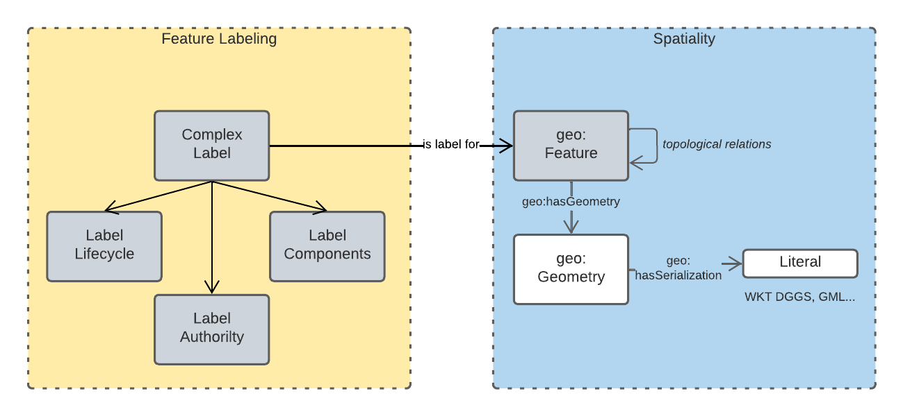
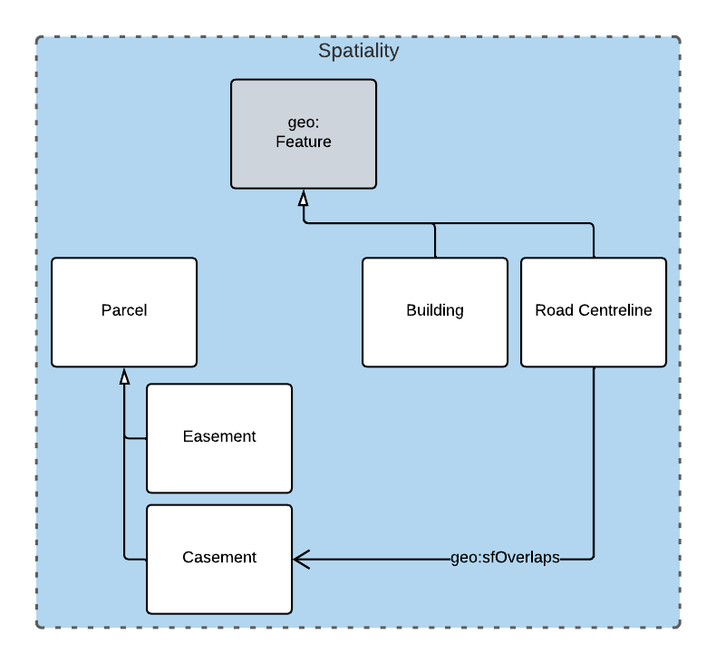
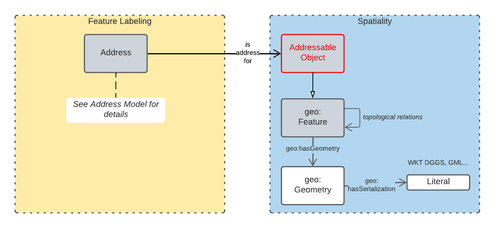
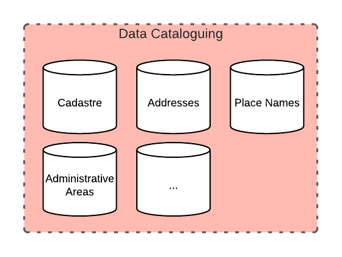
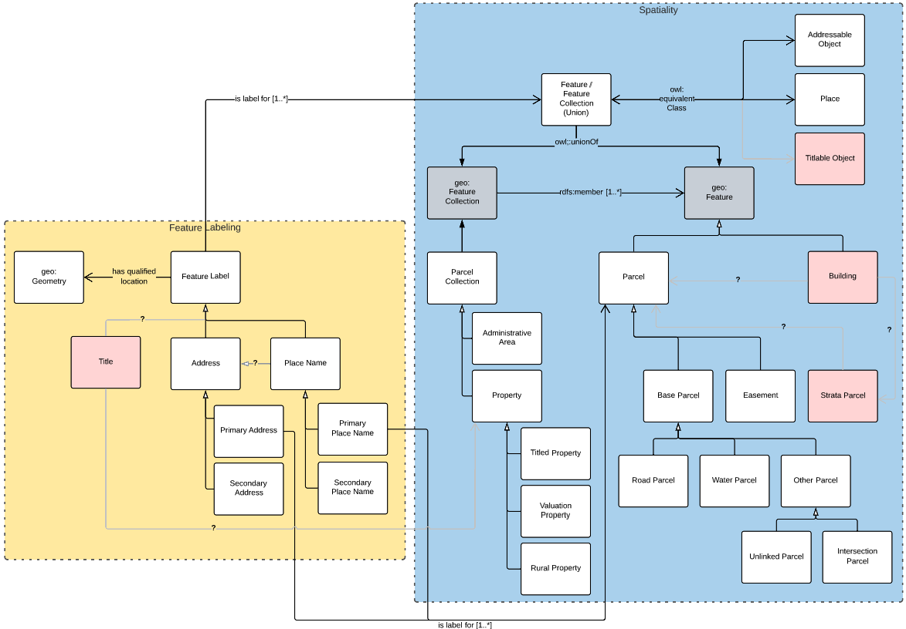

= Queensland Spatial Information Supermodel
:toc: left
:table-stripes: even
:sectnums:
:sectids:
:sectanchors:

This is an overarching model - a Supermodel - used to integrate multiple, individual, models together for use within a particular scenario.

This scenario is that of Queensland Cadastre, Addressing, Place Naming and Admin Areas.

== Introduction

The purpose of a Supermodel such as this one is to allow for data integration across multiple component models. This particular Supermodel indicates how to integrate data formulated according to the <<ANZ National Address Model>> (Candidate), the proposed <<QSI Cadastral Model>>, a model for Place Names and anotehr for Administrative Areas.

The Supermodel does this by implementing a <<Backbone Model>> that is an abstracted version of the main objects within the various Component Models. This Backbone Model does not implement any material not already present in the Component Model.

=== Modelling Methods

All the Component Models and the Backbone Model given here are implemented using the Web Ontology Language known as OWL <<OWL>>. OWL is a well used, standardised, powerful, formal, modelling language. Use of OWL creates data models that can be visualised and also that data can be validated against in automated ways, see <<Annex A: Data Validation>>.

OWL modelling is a set-theoretic modelling language which means using it involves placing things - concepts, digital representations of real-world objects - into _classes_. Objects in the classes are all similar in some way: perhaps they all have similar _properties_.

In this Supermodel, some fundamental classes are used for all things within scope, such as:

* `Feature` - Anything spatial (being or having a shape, position or an extent)
** From the GeoSPARQL 1.1 Ontology <<GEO>>
* `Geometry` - A coherent set of direct positions in space. The positions are held within a Spatial Reference System (SRS)
** From <<GEO>>
* `FeatureLabel` - Annotations applied to a `Feature`. Specialised kinds of FeatureLabel are expected to be used, such as `Address` or `PlaceName`
** From this Supermodel's <<Backbone Model>>

Specialised forms of `Feature` are used, such as `AddressableObject`, `Parcel` and so on. A `Geocode` is a specialised form of a `Geometry`.

OWL models visualisation is by diagrams that are similar to UML diagrams and use elements from the following key.

[id=fig-key]
.Key for OWL diagram figures
image::images/key.png[]

== Models

This Supermodel implements a "Backbone Model" which contains central elements from the various Component Models and acts as the integrative model between them The Backbone Model and Component Models together make the Supermodel.

[id=fig-models]
.An informal diagram the various Models of this Supermodel. The Administrative Areas model has not been detailed to date.
image::images/models.png[]

=== Backbone Model

The Backbone Model for this Queensland Spatial Information scenario overviewed in <<#fig-backbone, Figure 3>>. The formal characterisation of the model in OWL is given in the file https://nicholascar.com/qsi-supermodel/backbone.ttl[backbone.ttl].

[id=fig-backbone]
.An OWL diagram of the Backbone Model overview. Uncertain objects are shown in light red.
image::images/backbone.png[]

Figure 2 indicates two main conceptual domains (the yellow and blue) centered on `Feature Labels` (defined here) and `geo:Feature` s which are "Anything spatial (being or having a shape, position or an extent)." <<GEO>>. Feature Labels are any form of identifying information assigned to a Feature.

The class hierharchy expressed in this Backbone Model (with sub class of arrows) indicates that:

* Addresses, Administrative Areas and perhaps Titles are all forms of Feature Labels
* Place Names are a form of Address (a very simple one!)
* Places are Addressable Objects and Addressable Objects and Parcels are types of Feature

The various Component Models (next) use these classes of object and imlplement many more specilised forms of them.

=== Component Models

==== ANZ National Address Model

==== QSI Cadastral Model

[NOTE]
====
Introduce the Supermodel Concept

* Scenario explanation
* General Supermodel information
* List other preamble sections e.g. Terms & Defs
====

== Model

=== Model Structure

==== Data Domains

[id=fig-level-1]
.Level 1
image::images/level-1.png[]

==== Central Classes

[id=fig-level-2]
.Level 2
image::images/level-2.png[]

==== Main Classes

[id=fig-level-3]
.Level 3

===== Demonstration Implementation Overviews

[id=fig-level-3-cadastre, width="50%"]
.Level 3

[id=fig-level-3-addressing]
.Level 3

[id=fig-level-3-placenames]
.Level 3
image::images/level-3-placenames.png[]

==== Component Models

_Component Models_ are implemented for each Dataset within this scenario's scope. So far, a few Datasets are known to be within scope and these are given in <<#fig-level-3-datasets, Figure 7>>.

[id=fig-level-3-datasets]
.Level 3 Datasets

==== Overarching Model

For this Supermodel scenario, a fairly succinct overarching model that contains the _Main Classes_ of each of the _Component Models_ can be implemented since there is not a large number of Datasets for which _Component Models_ are needed. <<#fig-level-3-overview, Figure 8>> presents this overarching model.

[id=fig-level-3-overview]
.Level 3 Datasets

==== Spatiality

==== Feature Labelling

==== Data Cataloguing

:!sectnums:

== Annex A: Data Validation

== Bibliography

* [[GEO]] [GEO] Open Geospatial Consortium, _OGC GeoSPARQL - A Geographic Query Language for RDF Data_, OGC® Implementation Specification (2022). https://opengeospatial.github.io/ogc-geosparql/geosparql11/spec.html 

* [[OWL]] [OWL] World Wide Web Consortium, _OWL 2 Web Ontology Language Document Overview (Second Edition)_, W3C Recommendaton (11 December 2012). https://www.w3.org/TR/owl2-overview/